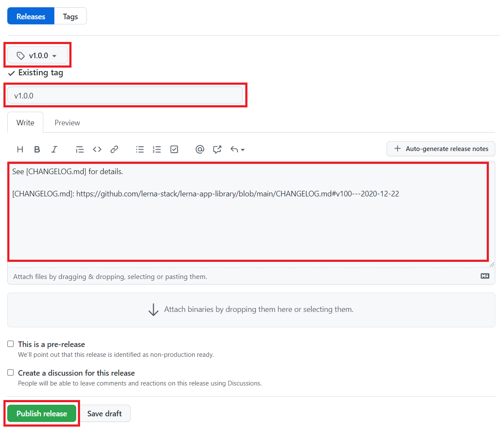

<!--
PR title format: Release vN.N.N

Please rewrite the versions in this template before submitting the PR:
- Current version: X.X.X
- New version: N.N.N
-->

## ToDo before merging
- [ ] [Update `README.md`](#update-readmemd)
- [ ] [Update `CHANGELOG.md`](#update-changelogmd)
- [ ] [Verify version numbers that need to be updated](#verify-version-numbers-that-need-to-be-updated)

### Update `README.md`
- Update `LernaVersion` to a new version

### Update `CHANGELOG.md`
- Add a section for the new version
- Update a link for `[Unreleased]`

### Verify version numbers that need to be updated

```shell
git grep --fixed-string X.X.X
...
```

## ToDo after merging
- [ ] [Push a tag](#push-a-tag)
- [ ] [Check Maven Central Repository](#check-maven-central-repository)
- [ ] [Create a release](#create-a-release)

### Push a tag

```shell
git tag vN.N.N
git push origin vN.N.N
```

### Check Maven Central Repository

[Maven Central Repository](https://repo1.maven.org/maven2/com/lerna-stack/)

**NOTE**
- They will appear about 10 minutes after publishing on [release workflow](https://github.com/lerna-stack/lerna-app-library/actions/workflows/release.yml)
- It requires more time to be able to find them with searching (about 2 hours max)

### Create a release

Create a release from the following URL:

https://github.com/lerna-stack/lerna-app-library/releases/new

**Template:**
```markdown
See [CHANGELOG.md] for details.

[CHANGELOG.md]: https://github.com/lerna-stack/lerna-app-library/blob/main/CHANGELOG.md#vNNN---YYYY-MM-DD <!-- write an anchor for the release version -->
```

**Example:**

